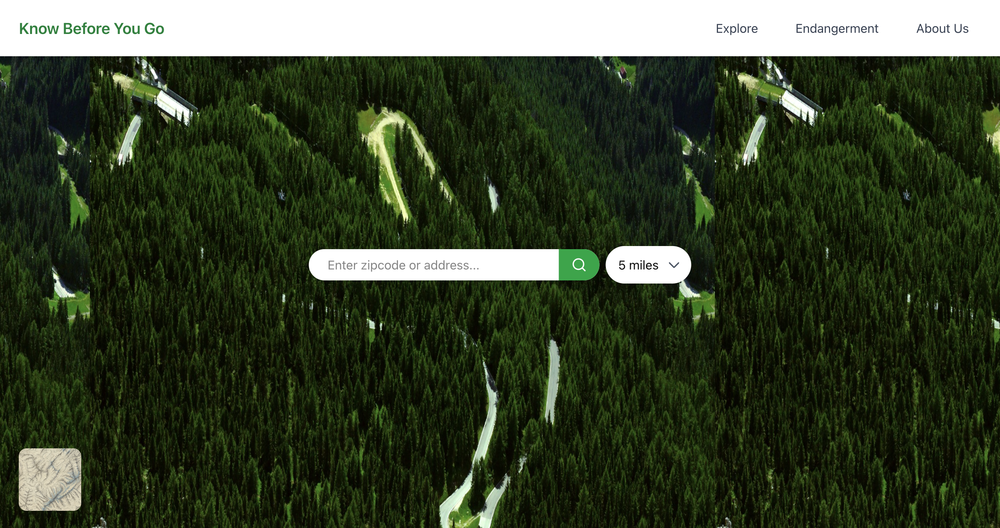
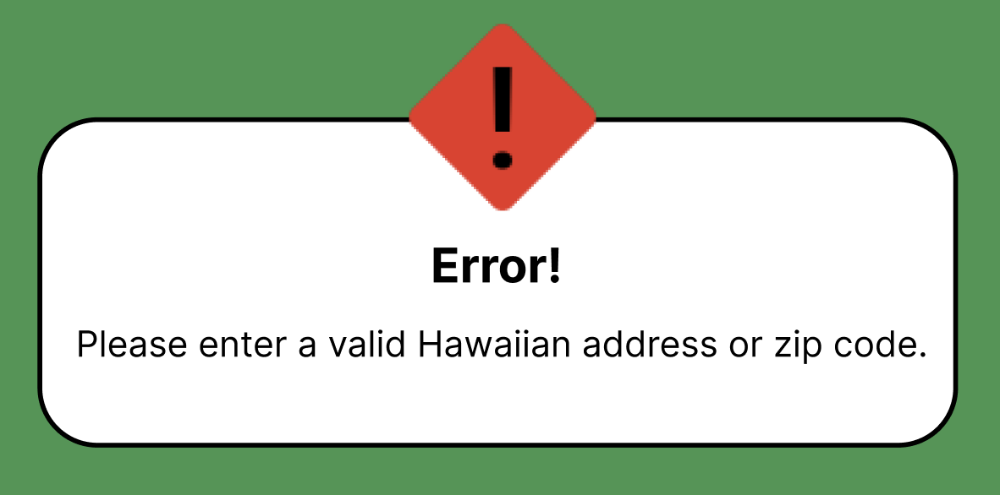
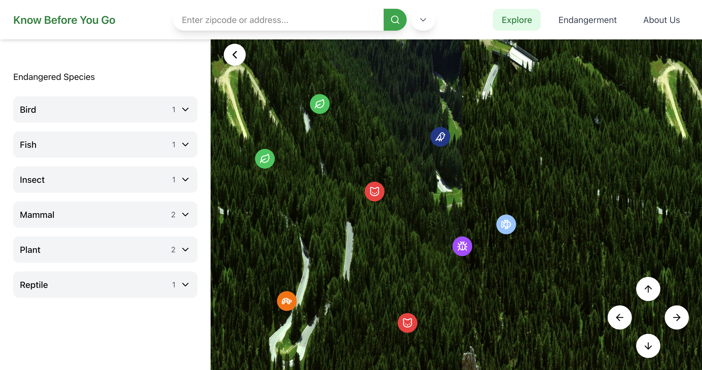
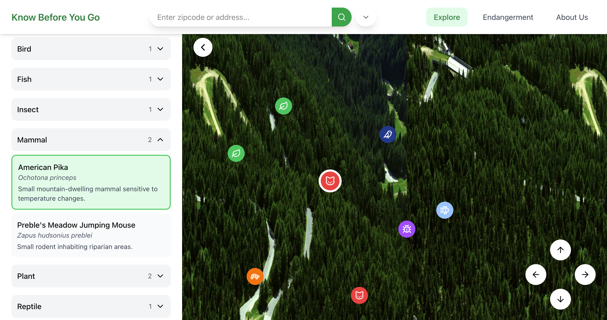
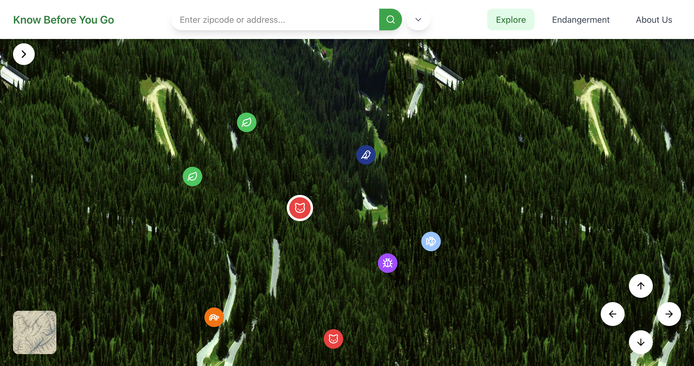
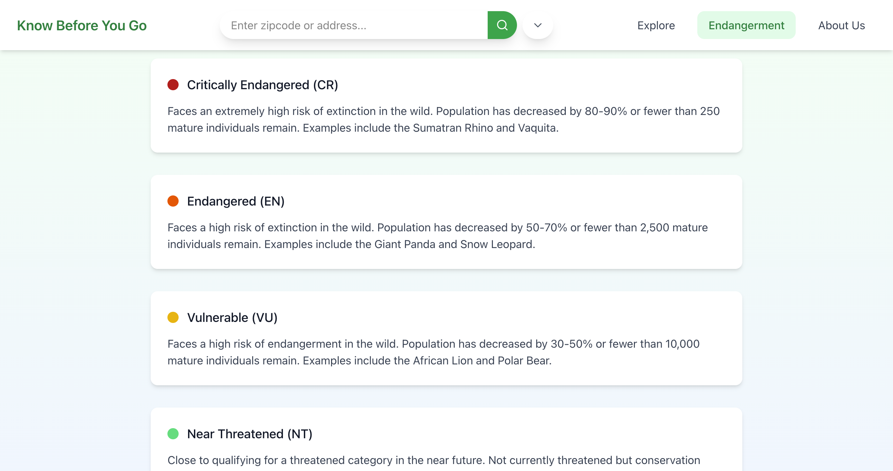
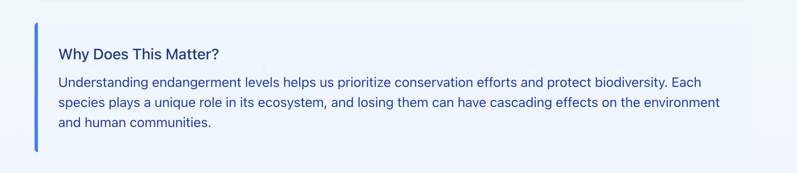
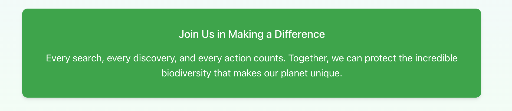

# Design & Specifications

## Design Description

### Problem

As one of the top ecologically unique regions on Earth, Hawaii is home to many native plant and animal species that you can find nowhere else. However, Hawaii has been a popular tourist destination for decades, which due to the busy human activity, the species are increasingly at risk with 60% of the plant and animal species becoming endangered due to the deforestation and habitat loss that come from building tourist spots (Sabarre, 2024). Annually, 7 million of visitors travel to Hawaii (Clayton), which many spend time in natural environments such as beaches, forests, hiking trails, and protected areas which many of these locations overlap with habitats of protected and endangered species, making them especially vulnerable to disturbance and environmental stress. 

Many travelers are unaware of which endangered species live near the places they visit or how their actions may affect them. Activities such as leaving designated trails, approaching wildlife, touching vegetation, or entering restricted areas can unintentionally damage habitats and disrupt animal behavior. While these actions are rarely intentional, repeated behavior by large numbers of visitors can contribute to long-term harm to endangered species and their ecosystems, bringing the scope of this problem being closely tied to visitor presence in sensitive ecosystems across the Hawaiian Islands.

These native species also play an important role in maintaining healthy ecosystems and preserving Hawaii's natural balance. However, with their decline, it weakens the ecosystems and the biodiversity that communities depend on. Along with the native species, the Hawaiian culture deeply connects to their land and ties back to their cultural identity and practices. Tourism in Hawaii also contributes to the strain on the native Hawaiians and cultural loss.

A few causes with this problem is the lack of accessible, location-specific information for visitors. Despite sustainable tourism and ecotourism emphasizing conservation, education, and responsible travel, the information is often generalized and not easily connected to the specific locations travelers plan to visit. As a result, visitors may want to be respectful but do not know which species are endangered nearby or what behaviors to avoid.

Prior efforts have been made to address these concerns with Hawaii implementing sustainable tourism initiatives, protected species regulations, and responsible travel guidelines to encourage environmentally conscious behavior. Although these educational resources are available through the tourism and government websites, the solution falls short at times as information can be encountered too late in the travel experience, and easy to overlook, resulting in many visitors remaining unaware of endangered species living nearby or how to adjust their behavior accordingly.

Ultimately, endangered species in Hawaii continue to face risks caused by unintentional human impact as a result of the ongoing gap between conservation knowledge and visitor awareness. Therefore, hinders working progress toward the UN SDG 15, which aims to reduce the degradation of natural habitats, halt the loss of biodiversity and to protect and prevent the extinction of threatened species.

### Citations
- Clayton, D. (n.d.). Trouble in paradise: The effects of tourism on the culture of the hawaiian islands. Retrieved January 11, 2026, from https://pressbooks.library.upei.ca/artsreview-xi/chapter/trouble-in-paradise/
- “Goal 15 | Department of Economic and Social Affairs.” United Nations, United Nations, sdgs.un.org/goals/goal15#targets_and_indicators. Accessed 14 Jan. 2026. 
- Sabarre, Ina. “The Impacts of Tourism on Hawaii.” The Environmental Defense Initiative, 21 Aug. 2024, www.tedinitiative.org/blog/the-impacts-of-tourism-on-hawaii. 
- Vininsky-Oakes, Esther. “The Impact of Over-Tourism on Local Environments in Hawaii.” The Starfish Canada, 9 Sept. 2025, thestarfish.ca/journal/2025/09/the-impact-of-over-tourism-on-local-environments-in-hawaii. 
- Sigel, Alyna. “Ecotourism: Traveling with an Impact.” Seaside, Seaside, 21 Dec. 2024, www.seasidesustainability.org/post/ecotourism-traveling-with-an-impact. 

## Solution Summary

This product’s goal is to provide a location-based and interactive way for users to learn about endangered species near the places they visit. Travelers are able to search by address or ZIP code and view endangered species within a chosen radius, the application makes species information visual and tied directly to real locations. Users can also explore species through an interactive map and categorized species list, with access to important information such as species names, endangerment level, descriptions, and images in a simple interface. This product is aimed at addressing the gap between visitor awareness and conservation knowledge by supporting responsible travel behavior, and reducing unintentional harm to endangered species, working towards the UN SDG 15 in increasing awareness and understanding of vulnerable ecosystems.

## Design

The website prototype can be found at https://launch-tidal-41224810.figma.site/. Note that the prototype is used as a reference. The finalized website will have differences.

Every page will consist of:
- Body 
- Navigation bar across the top 

The color scheme is black, white, and forest green, to fit the environmental focus of the website.

### Navigation Bar

The navigation bar has our website name “Know Before You Go” and button links “Explore” where users can scroll through a map of Hawaii that shows all endangered species icons nationwide, “FAQ” (listed as “Endangerment” in all images) which is a page that informs users about what different types of endangerment are and what they mean, and “About Us” which talks about our problem statement and goal. 

The navigation bar has a white background. The website name is on the left side of the navigation bar in bold forest green text, and the menu options are on the right in black, regular font weight. When the user hovers over any of the menu options, the button they hover over will fade to a light grey background with rounded corners. 

When the user clicks on any of the menu options, the selected button turns a light green background with rounded corners. The button text becomes bolded, and the button font becomes colored forest green.

The navigation bar has a slight shadow below it, noticeable on all pages that don’t feature a map in the background (FAQ and About Us sections).

### Home Page

Figure 1.1: Home page

The home page is the initial screen that the user sees when the page loads. It consists of the navigation bar at the top, the map on the rest of the screen as the background, the map appearance button on the bottom left and the search bar and radius button in the middle of the screen.

Anytime the user searches an address or zip code from the home screen, the search will automatically redirect them to the explore page with the results of their search. The appearance of the resulting page can be found in section Explore.

***Search bar***:

The search bar is about a third of the screen width, pill-shaped, and white, with gray text “Enter zip code or address…”. The search submit button is on the right edge of the pill shape, taking up about 1/8th of the entire bar, with a forest green background and a black magnifying glass icon. When the user hovers over the submit button, it turns a slightly darker shade of green.

If a user types in an address that doesn’t exist, or is outside of Hawaii, an error message will appear below the search bar in a white text box with rounded corners with the text “Please enter a valid Hawaiian address or zip code”. The error message fades after 8 seconds.

The error message is in a white rectangular text box with rounded corners and a black border. The title “Error!” is in the middle of the text box, in black bolded text, with smaller black text in regular font on the line below explaining the specific error. 

There is an alert icon in the middle at the top of the text box, halfway in and out of the text box. The alert icon is a red diamond shape with a black exclamation point in the middle of it. Refer to Figure 1.2 for reference.

Figure 1.2: Address input error message

If the user attempts to submit an empty search, nothing will happen.

***Radius button***:

Users can change the radius of distance that they want search results to be displayed from. To the right of the search bar there is another pill shaped button, right next to the search bar but not connected. 

The radius button is the same height as the search bar but much shorter in length, which users can click to change the radius options. The radius distance default selected option is 5 miles with the options for users to select 1 mile, 5, 10, 25, 50 miles, or custom length. 

The radius button is white like the search bar with black text saying “_ miles” (default text “5 miles”) and a downward arrow. 

When users click on the radius button, a white rectangle with rounded corners will appear below the button with radius options in black text in ascending order for users to choose from. The custom option is at the bottom of the list. The selected radius will have a black checkmark to the left of it inside the rectangle (by default that means the “5 miles” option will have a checkmark by it).

When users hover over each of the radius options, the background of the hovered option will turn light grey with rounded corners. The selected option’s background will turn light green, with forest green text.

When the user selects to enter a custom length, the checkmark appears by the custom option, and a text box will appear below the radius option rectangle. It is white with rounded corners like the radius option rectangle. 

When the user enters the amount, the text box disappears and the entered amount appears in the radius button, in place of where the “5” initially was. If the custom length entered isn’t a whole number, the entered input is rounded to the nearest mile. The radius option dropdown doesn’t disappear until the user clicks on the arrow on the radius button again. 

After an initial search using the search bar, or if the user clicks off the initial loaded screen to another menu option, the search bar and the radius button appear near the middle of the navigation bar, evenly spaced between the website name and the menu options. 

The search bar looks the same as it looked on the home page, with a light shadow below it. The radius button won’t have any text on it, with just the downward arrow in the middle of the pill shape. When the user clicks on it, the white dropdown menu will appear the same way as it appears on the home screen. 

If the user navigates to the edge of the selected radius on the map, a bolded black border will notify the user that they have reached the edge of their desired radius. Any endangered species beyond the desired radius will not be displayed on the map as icons, or listed in the breakdown list (see Explore for clarification).

***Background***: 

The home screen background features a satellite image by default. Users can click and drag on it to move around on the map. The default location for the satellite map is 96813, or the zip code for downtown Honolulu. The abundance of diverse wildlife in the region, paired with defaulting the map onto the state capital where wildlife is vulnerable due to tourism, creates a captivating starting point for users to browse when the website first loads. 

If the user navigates off the territory of Hawaii, an error message appears in the middle of the screen. The error message looks the same as the address error message (see Figure 1.2) but instead says a message urging the user to navigate back to Hawaiian land.

***Map appearance***: 

Users have the ability to change the appearance of the map based on preference. In the bottom left corner of the screen, users have the option to switch between a satellite map image (default), and a road map image. Users can change through the options by clicking on the square button with rounded corners located in the bottom left corner. 

While the satellite map is selected, the map button displays an image of a road map. When the user clicks on the button, the website map background changes to the road map option, and the map button changes to a satellite image. To switch back, the user can click on the button again. 

When the user hovers over the map button, a bolded black border appears around it. 

### Explore

Figure 2.1: Expanded breakdown list

The explore page looks similar to the home screen. It is the page where users can browse the map and learn about endangered species in the US. It will feature the navigation bar (with the search bar), the map background, the map appearance button, animal and plant map icons, and a sliding breakdown list of each endangered species shown as an icon on the map. When the page initially loads, the breakdown list is hidden. 

There are two ways the user can end up on the Explore page: clicking from the menu, or by searching a valid zip code from the home screen. If the user navigated from the menu without searching for a specific address, the Explore page will by default show endangered species in the zip code 96813, or the zip code for downtown Honolulu, in a 5 mile result radius (default setting). If the user appeared on the Explore page from an address search, the map will display the results of the desired address in the selected radius.

***Map icons***:

Endangered species are displayed on the map as circular icons. The locations of the icons are approximate, based on available data.

There are 6 possible icons that can be found displayed on the map:
- Mammals: Shown as a red background with a white icon image of a cat. Note: this icon accounts for land and water mammals, so endangered whale species and other water mammals are displayed with the same icon even in water.
- Fish: Shown as a light blue background with a white icon image of a fish.
- Insects: Shown as a purple background with a white icon image of a bug.
- Birds: Shown as dark blue background with a white icon image of a bird.
- Reptiles: Shown as an orange background with a white icon image of a turtle.
- Plants: Shown as a green background with a white icon image of a leaf.

When the user hovers over a map icon, the icon slightly grows. It shrinks back when the mouse leaves the icon.

As the user moves the map around, the icons remain in the same place on the map, moving on the screen with the map.

When the user selects a map icon either by clicking on it from the map or selecting a particular species, the selected icon grows and a bold white border appears around the icon. The icon will remain selected until another icon is clicked on, or the user leaves the page and returns. 

The results for the last searched zip code will remain even if the user clicks onto other menu options and returns to the explore page. 

***Breakdown list***:

In the top left corner, right below the navigation bar, a circular button gives the user access to the breakdown list of every species shown on the map from the search results.

The button is circular, with a white background and a black arrow icon pointing to the right. The button has a slight shadow below it, noticeable on light-colored parts of the map. 

When the user clicks on the button, the breakdown list slides out from the left of the screen, and the button slides out with the list, remaining on the right of the list without touching it. 

When the breakdown list expands, the arrow in the button turns to the left, facing the breakdown list. When the user clicks on the button again, the breakdown list slides back to the left, and the button turns back to the right. 

Figure 2.2: Selected species breakdown expanded

Figure 2.3: Breakdown list hidden

The expanded list takes up the entire length of the screen below the navigation bar. The list has a white background, and each icon type is listed in alphabetical order (starting with birds, ending with reptiles). 

The icon type buttons are light grey with black text. The button species is listed on the right. On the left side of the button, there is a downward arrow. The user can click anywhere on the button to read about specific endangered species that are within the desired radius. On the left side of the downward arrow is the amount of animals/plants in the particular icon list, also in black text. 

When the user clicks on an icon button, the downward arrow flips upward, the same way the circular button which expands the breakdown list flips from left to right. On click, the list of animals/plants that falls under the clicked species appears below the button, separated into disconnected rectangles one below the other.

Each rectangle is a slightly lighter gray than the breakdown list icon button, with rounded corners. The organisms are listed alphabetically. 

Each organism rectangle contains the following information:
- Organism’s common name (bolded in black text, slightly larger font than the rest of the information)
- Organism’s latin name (italicized in grey text)
- Organism description (same size font as latin name in grey but not italicized)
- Level of endangerment with a circle of the corresponding color to the left of the level (refer to the FAQ section for colors and endangerment types)

When the user selects an organism from any of the lists, the background color of the selected rectangle turns light green with a bolded forest green border. The corresponding map icon also becomes selected as described in the Map icons section. The rectangle remains selected even if the list is closed until another organism is selected, or the user clicks onto another menu option in the navigation bar. 

Above the list of endangered species is the text “Endangered Species” in grey (refer to Figure 2.1). If the user enters a location and radius that doesn’t have any endangered species within it, instead of the text and list, there will be a message in the same font, notifying the user that no known endangered species exist in the selected region.

The breakdown list button and map appearance button are both equally spaced away from the edges of the screen (refer to Figure 2.3).

### FAQ

The FAQ page (titled “Endangerment” in all images) is included to help inform users about the levels of endangerment that exist, how data is collected, and general information about living with and protecting wildlife.

***Background***:

The page background is a lightly colored gradient, going from a light green color to a cool blue (refer to Figure 3.1). When the user scrolls through the page, the background doesn’t move, only the text contents on it.

***FAQs***:
The title “FAQ” is at the top of the page in black font, slightly larger than the FAQ titles listed below it. 
The following FAQs are listed:
- What are the Levels of endangerment?
- How is endangerment data collected?
- What are some simple ways of protecting wildlife from human harm?

Each FAQ title is in regular-weight font colored in forest green. The title is the same font size as the endangerment level titles (refer below). The titles are also on the same indent as the left edge of the answer boxes (meaning it’s not centered at the top of the page but near the left side).

***Endangerment levels (FAQ #1)***:

The levels are separated into rectangles with rounded corners, going from most severe levels to least. Each level has a corresponding color to the left of the severity level, and two abbreviating letters to the right in parenthesis.

The levels are included in the following order:
- Extinct (EX) with a black circle
- Extinct in the Wild (EW) with a dark blue circle
- Critically Endangered (CR) in a deep red color
- Endangered (EN) in orange
- Vulnerable (VU) in yellow
- Near Threatened (NT) in light green
- Least Concern (LC) in forest green

Figure 3.1: Model endangerment levels

Each level is in a separated rectangle with rounded corners. The rectangle has a white background, and a small shadow below it. 

The contents of each level are displayed as follows:
- Corresponding level color, level name, and level abbreviation (in parenthesis) at the top left of the rectangle in black, slightly larger than the rest of the rectangle contents
- Short description of the level in a grey font, including examples of animals who fall each level, and required number of existing organisms for an organism to fall within the level

Below all the levels is a separate rectangle titled “Why Does This Matter?” with a short description talking about why endangerment levels matter. The text inside the rectangle is blue to stand out from the other rectangles.

Figure 3.2: Endangerment levels description

The rectangle background is the same shade of blue as the page background, blending in with the background. The left side of the rectangle border is colored the same blue as the rectangle content font color (refer to Figure 3.2). The rectangle contents are the same size as corresponding endangerment level rectangle contents, the only difference is the font and background color.

***Data Collection (FAQ #2)***:
The answer to the second FAQ talks about the datasets we used to collect endangerment data. The answer will include a disclaimer explaining that the data used is self reported and observational, making it prone to inaccuracies.

***Wildlife Protection (FAQ #3)***:
The third FAQ lists some facts to help protect wildlife from humans, such as instructions not to feed it, first aid measures, etc. 

The answer to FAQs #2 and #3 are not placed in a rectangle box. The black text answering each question is written as a paragraph, with the textbox indent beginning at the same point as the FAQ title (so all text is in line with the titles and rectangle boxes).

This page is static.

### About Us

This page is similar to the FAQ page. Content is organized in the same rectangular boxes as on the FAQ page, titled “About Us” in regular-weight forest green font, the same size as the title content of following rectangle boxes. The title is on the same indent as the left edge of the rectangular boxes (not in the center of the page).

***Background***:

The background is the same as the background of the FAQ page (refer to FAQ) but the color order is flipped. This means that the top of the page is colored the same light blue as the bottom of the FAQ page, and the bottom of the About Us background is the same green as the top of the FAQ page.

The background doesn’t move as the user scrolls through the page (refer to Background section of FAQ).

***Page contents***:

The About Us page is separated into 5 rectangular boxes designed the same way as the endangerment levels text boxes (rounded corners, white background with a slight shadow below the rectangle)
The featured boxes are titled:
- Our mission 
  - Short description of the purpose behind the Know Before You Go website
- The Problem
  - A short description that lists the issues that a lack of awareness of existing endangered species causes (habitat destruction, continuing decline of vulnerable populations, missed opportunities for community involvement, etc)
- Our Solution
  - A list of features our website has that allows users to educate themselves, explore endangered organisms anywhere in the US, and learn about each individual species
- Our Goals
  - There are three goals:
    - Raise awareness
    - Inspire action
    - Build Community
  - Each goal title is written in black in a slightly smaller font than the rectangle title, but bigger than the goal description. Each goal has a short description below it
- Join Us in Making a Difference
  - A short statement of encouragement for viewers and users of our platform to act
  - The rectangle title is in the center of the rectangle instead of on the left
  - This box is different from all other on the page, with a bright forest green background and a white font

Figure 4: Appearance of text box encouraging viewers 

Each rectangle box contains a title on the left side which is in larger font than the rest of the rectangle contents, in forest green, and corresponding content which is slightly smaller than the title written in grey unless explicitly stated otherwise in the bullet points above. 

This page is static.
